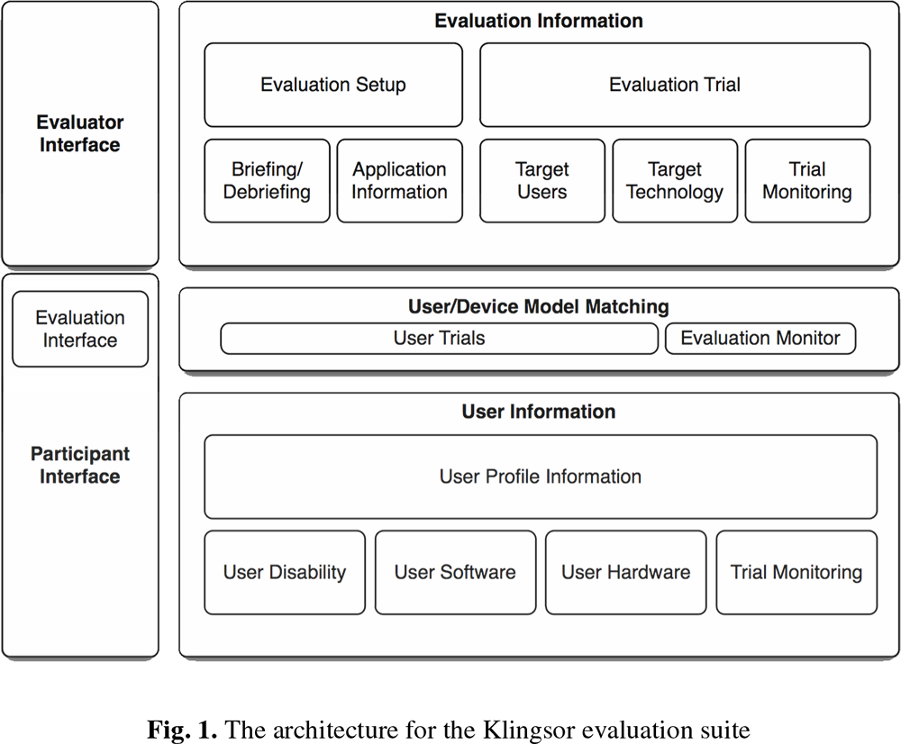

# Tekster som handler om evalueringsmetoder for brukervennlighet (USA-ASS)

[Home](./UU-ASS.md)

These articles, papers and chapters discuss assessment methods for usability that are needed for the evaluation in universal design:
* [__Power & Petrie (2019)__ Working With Participants](#power-petrie-2019-working-with-participants)
* [__Sauer et al. (2019)__ Extra-laboratorial usability tests: An empirical comparison of remote and classical field testing with lab testing](#sauer-et-al-2018-extra-laboratorial-usability-tests-an-empirical-comparison-of-remote-and-classical-field-testing-with-lab-testing)
* [__Miao et al. (2016)__ Contrasting usability evaluation methods with blind users](#miao-et-al-2016-contrasting-usability-evaluation-methods-with-blind-users)
* [__Bruun & Stage (2012)__ The effect of task assignments and instruction types on remote asynchronous usability testing](#bruun-stage-2012-the-effect-of-task-assignments-and-instruction-types-on-remote-asynchronous-usability-testing)
* [__Power et al. (2011)__ Remote Evaluation of WCAG 2.0 Techniques by Web Users with Visual Disabilities](#power-et-al-2011-remote-evaluation-of-wcag-20-techniques-by-web-users-with-visual-disabilities)
* [__Bruun et al. (2009)__ Let your users do the testing: a comparison of three remote asynchronous usability testing methods](#bruun-et-al-2009-let-your-users-do-the-testing-a-comparison-of-three-remote-asynchronous-usability-testing-methods)
* [__Power et al. (2009)__ A Framework for Remote User Evaluation of Accessibility and Usability of Websites](#power-et-al-2009-a-framework-for-remote-user-evaluation-of-accessibility-and-usability-of-websites)
* [__Petrie et al. (2006)__ Remote usability evaluations with disabled people](#petrie-et-al-2006-remote-usability-evaluations-with-disabled-people)
* [__Brush et al. (2004)__ A comparison of synchronous remote and local usability studies for an expert interface](#brush-et-al-2004-a-comparison-of-synchronous-remote-and-local-usability-studies-for-an-expert-interface)
* [__Boren and Ramey (2000)__ Thinking aloud: reconciling theory and practice](#boren-and-ramey-2000-thinking-aloud-reconciling-theory-and-practice)

## General

[__Power & Petrie (2019)__](#power-petrie-2019-working-with-participants) emphasize four key aspects when working with people with disabilities: (1) treating participants with respect throughout the process () ethics, language, supportive facilities), (2) anticipating needs and preferences for alternative format materials, (3) ensuring minimum technical accessibility  standards prior, and (4) identifying the best support setup (locally or remote).
[__Sauer et al. (2019)__](#sauer-et-al-2018-extra-laboratorial-usability-tests-an-empirical-comparison-of-remote-and-classical-field-testing-with-lab-testing)investigated the effects of testing environment in usability testing along the parameters of different types of artefacts (website, mobile phone simulation, mobile phone), methodological approaches (synchronous/asynchronous remote testing, field testing, local lab testing), and operational conditions (good/poor usability, dual tasks demands).  
They found that no significant difference between field and lab-based testing in situations where circumstances were favorable, at the same time as some differences occurred in cases were circumstances were not favorable. 
They advise to conduct usability testing as close as possible to the real life situation.
[__Miao et al. (2016)__](#miao-et-al-2016-contrasting-usability-evaluation-methods-with-blind-users) conduct usability tests with blind and visually impaired participants testing local vs synchronous testing and tactile paper prototyping v computer-based prototyping.
They found that local synchronous remote testing gave comparable number of usability problems, reduced completion time for blind participants but not for the visually impaired and sighted, and that blind and visually impaired participants prefer the local test.
They list problems related to the synchronous remote testing, and give recommendations on how to overcome them.
[__Bruun & Stage (2012)__](#bruun-stage-2012-the-effect-of-task-assignments-and-instruction-types-on-remote-asynchronous-usability-testing) conducted a comparative study investigating the effect of task assignments and instruction types on remote asynchronous usability testing.
They show that predefined tasks lead to more detected usability issues than working on own issues, at the same time as instructions by means of examples lead to more detected issues that using a conceptual definition as introduction.
[__Power et al. (2011)__](#power-et-al-2011-remote-evaluation-of-wcag-20-techniques-by-web-users-with-visual-disabilities) propose a lightweight, flexible and remote methodology using a text website and questionnaires to assess implementation techniques for WCAG Success Criterion that they demonstrate on the Success Criterion 2.4.4. 
The results suggest that only an explanation in plain text within an anchor element fulfills the criterion almost 100% of the time, although other techniques can reach high compliance as well.
[__Bruun et al. (2009)__](#bruun-et-al-2009-let-your-users-do-the-testing-a-comparison-of-three-remote-asynchronous-usability-testing-methods) compared three remote asynchronous usability testing methods (user-reported critical incidents, forum-based online reporting and discussion, diary-based longitudinal user reporting) with conventional laboratory-based thinking aloud testing as benchmark. 
They found out that the remote methods found significantly less issues (with the diary performing at 50% for some of the issue types), at the same time as they require significantly less time.
[__Power et al. (2009)__](#power-et-al-2009-a-framework-for-remote-user-evaluation-of-accessibility-and-usability-of-websites) define a framework containing requirements and architecture of an automated online tool to help with the design, deployment and analysis of evaluations with participants that have some sort of impairment.
[__Petrie et al. (2006)__](#petrie-et-al-2006-remote-usability-evaluations-with-disabled-people) conducted two case studies (one formative, one summative) for asynchronous remote assessment methods and compared the results to local evaluation.
Their results show that the quantitative data is highly comparable, at the same time as the amount and richness of the qualitative data is much lesser for the remote evaluation.
They conclude that remote evaluation is highly appropriate for summative studies, whereas local evaluation should be used for formative studies.
[__Brush et al. (2004)__](#brush-et-al-2004-a-comparison-of-synchronous-remote-and-local-usability-studies-for-an-expert-interface) compared results from a local and a synchronous remote usability study.
The results suggest that the number of usability issues found including type and severity is comparable, at the same time as the qualitative experience may differ.
[__Boren and Ramey (2000)__](#boren-and-ramey-2000-thinking-aloud-reconciling-theory-and-practice) introduce the concept of speech genre as theoretical basis for a thinking aloud protocol.
They present a new framework for usability testing in which the evaluator: (1) sets the stage for a productive interaction, (2) elicits a verbal report that is undirected, undisturbed, and as constant as possible while still accounting for the social nature of speech, provides guidance on (3) interventions often required by problems and disturbances arising in usability testing, and (4) proactive interventions to retrieve more information from the participant.

## Power & Petrie (2019) Working With Participants

[Up](#tekster-som-handler-om-evalueringsmetoder-for-universell-utforming-uu-ass)

__Participants__:  
_None_

Power and Petrie (2019) present core barriers and common solutions for website evaluation with participant with disabilities.
1. They give general advice concerning ethics (checklists, ethics committee), and recruitment and engagement (local/national organizations, interesting experience, briefing, debriefing). 
2. They discuss physical environments (travel, access), alternative formats or enhanced materials (bigger print, transcript), individual assistance (personal, interpreter), and language (ask about preferences).
3. They present generative user research as methodologies for understanding users and their needs and preferences including questionnaires (should be technically accessible), and focus groups (how does the interaction work? include people with different disabilities? how many?) and interviews to contextualize the data from the questionnaires.
4. They show evaluative user research to refine design in an iterative cycle, collect information, or understand impact of different design choices.
The researchers should minimum of accessibility, keep track of assistive tools, consider in-situ or remote evaluation (asynchronous, synchronous, provide appropriate training material), provide protocol for formative evaluations, and consider recording of different performance and preference variables.

## Sauer et al. (2019) Extra-laboratorial usability tests: An empirical comparison of remote and classical field testing with lab testing

[Up](#tekster-som-handler-om-evalueringsmetoder-for-universell-utforming-uu-ass)

__Participants__:  
Sighted (?)

Sauer et al. (2018) investigated the influnece of testing enviornments on usability testing including physical features (lab, field, home, etc.), social features (evaluator being presented or not), and difficulty of the task (duality, good/low usability, etc.).
they conducted three experiments where they analyzed factors of type (field-based, synchronous/asynchronous remote), product quaity (usability, price), task demand (single v dual) in a summative study where they analyzed quantitative measurements (performance, perceived usability, etc.):
1. Synchronous v asynchronous testing v lab-based testing.
There was no effect of testing method. Neither remote testing methods or the lab-based method had a significant advantage or disadvantage.
2. Aynchornous remote testing vs lab-based testing using different artefact (computer simulation of a smartphone) and different product quality (bad/good usability, price).
They showed the importance of product properties and testing methods, and the influence of social expectations.
There was no difference in performance between remote and local evaluation for a product with good usability, however performance was worse in the local than in the remote testing for a product with bad usability.
they explaide that with a social inhibition effect that states that `performance on more difficult tasks is impaired during the presence of others`.
Moreover usability rating were higher in local evaluation than in remote testing.
This can be explained by social expectations, namely that users are more hesitant about negavite feedback if the evaluator is present.
3. Field testing v lab-based testing using a singel/dual task approach.
They did not find a significant difference due to testing method used.
Performance were poorer foir the single task in the local than in the field evaluation.
In the field, dual task had a poorer performance than the single task, whereas in the lab there was no significant difference.
Field/dual had the poorest performance, lab/dual had the best performance.
The authors explain that with the role of arousal. More precisely having the second task raising arousal in the lab to an optimal level.

To sum up, Sauer et al. (2018) found out that the outcome of usability testing depends on a complkex interaction between multiple variables and factors including usability, demand, social expectations, etc.
however, the output may be difficult to predict.
Moreover, the presence of others (e.g. the evaluator) may interact with task difficulty.
On the one hand, presence (virtual or physical) might increase physiological arousal.
On the other hand, presence might increase the need to confirm hte other's social expectations.

They conclude, that different testing methods did not show any obvious different main effects, at the same time as other contextual factors (usability, difficulty, evaluator presence etc.) moderate the influence on the outcome noteably.
They advise, therefore to test a system as close as possible to the real case setting.

## Miao et al. (2016) Contrasting usability evaluation methods with blind users

[Up](#tekster-som-handler-om-evalueringsmetoder-for-universell-utforming-uu-ass)

__Participants__:  
* Blind
* Visually impaired
* Sighted

Miao et al. (2016) compare local testing with synchronous remote testing, and tactile paper prototyping with computer-based prototyping (not relevant right now - 10/2020).

They analyze three different types of data:
1. Effectiveness of the evaluation:
   * Quantitative data: task completion time, number of usability issues
   * Qualitative data: severity (minor, major, catastrophic), categories
2. Perceptions and experiences of participants:
   * Quantitative data: difficulty, time for preparation, setup and dismantling (uninstalling, etc.), number of positive and negative comments
   * Qualitative data: positive and negative comments, non-verbal reactions
3. Perceptions and experiences of evaluator:
   * Qualitative data: subjective opinions
   
They define usability issues where:
1. The participant verbally indicates something that is unclear or confusing.
2. The participant's utterances indicates a misconception or confusion.
3. The participant's actions indicate a wrong path.

We skip the first study for now.

In the second study they compare synchronous remote and local test with blind, visually impaired and sighted people.
in the remote setting they used WebEx where the output of the screen reader had to be made audible via loudspeaker and transmitted via microphone. 
The results show that the completion time is significantly different for blind participants (due to unfamiliarity), but not for visually impaired or sighted people.
The Number of usability problems is comparable for all participants. 
The preparation, setup and dismantling time was significantly higher for the remote testing for all participants.

The most common negative comments by the participants on remote evaluation were related to too much effort, high complexity, loudness of screen readers, security and privacy concerns (insecurity, being observed, remote control).
The most positive comments by the participants on local evaluation were no setup required, face-to-face communication, positive exam feeling.
Advantages according to the evaluators include realistic environments, ease of recruitment.
Problems according to the evaluators, include insufficient observations (no observation f braille output, no facial expressions, delay of sound and picture, configuration problems), Hight technical requirements for participants, high computer skills required by the participants, high requirements of evaluator, security and privacy concerns, high effort level, external interruptions.

They give advices for technical improvements:
* Executable on various operating systems.
* Reduce effort required to install.
* Usable and accessible for blind and visually impaired people.
* Technical requirements:
   * Internet speed test.
   * Remote control.
   * Screen recording and transmission.
   * Voice and screen reader output transmission and recording.
   * Braille output transmission and recording.
* Real-time transmission of data.

And recommendations for organizational improvements:
* Understanding of participants (AT, etc.).
* Minimizing security concerns and gaining trust.
* Pilot tests with blind and visually impaired people.
* Minimizing interference with privacy.

## Bruun & Stage (2012) The effect of task assignments and instruction types on remote asynchronous usability testing

[Up](#tekster-som-handler-om-evalueringsmetoder-for-universell-utforming-uu-ass)

__Participants:__
Sighted (?)

Bruun & Stage (2012) conducted a comparative study investigating the effect of task assignments and instruction types on remote asynchronous usability testing.
Tasks require a considerable knowledge beforehand, and might create artificial scenarios, whereas free tasks are more authentic.
Instructions can be given either in person or online through the Internet.
The authors define deductive (a general rule is given), inductive (specific observations or examples are given) and combined deductive and inductive instruction types.

They conducted the study on university students in two groups: local and asynchronous remote evaluation.
In the experiment, they give deductive instructions by providing a general rule (conceptual definition like "not useful", "difficult to learn", "difficult to remember", "ineffective to use", "unsatisfying to use", etc.)
They also gave inductive instructions by providing examples of usability issues without definitions related to consistency and affordance).

On the one hand, they show that 
users receiving predefined tasks completed more tasks, identify more usability problems, and have higher level of problem agreement 
than users working on their own tasks.
On the other hand, users working on their own tasks identify a more variety of usability issues.
Finally, users who received inductive instructions identified more usability issues than users who were given deductive instructions, at the same time as the satisfaction rating were higher from users with inductive instructions as well.
The authors could not in any bias resulting from the examples in the inductive instructions, or that the combination of the inductions and deductive instructions was preferred before either individual.

## Power et al. (2011) Remote Evaluation of WCAG 2.0 Techniques by Web Users with Visual Disabilities

[Up](#tekster-som-handler-om-evalueringsmetoder-for-universell-utforming-uu-ass)

__Participants__:  
* Blind (w/ screen raders)
* Visually impaired

Power et al. (2011) present a lightweight and flexible methodology to efficiently collect data supporting or rejecting different WCAG techniques from users with visual disabilities remotely. 
In their technique they
(1) setup a website where each webpage represents one specific task implemented in one specific technique,
(2) recruit participants online through crowdsourcing,
(3) instruct users to website and undertake small tasks,
(4) answer through questionnaires (correct answer, confidence and difficulty rating), and
(5) collect data about the operating system, user agent and assistive technologies.
They implemented this approach for evaluating different implementation techniques for the WCAG 2.0 Success Criterion 2.4.4 (accessibility of links).
The results suggest that only G91 (clear text embedded in anchor tag) succeeds in almost 100% of the time, although other techniques like G53 (click her), H30 (alt image text), H77 (enclosing list), etc. can reach high success and confidence and low difficulty as well.

## Bruun et al. (2009) Let your users do the testing: a comparison of three remote asynchronous usability testing methods

[Up](#tekster-som-handler-om-evalueringsmetoder-for-universell-utforming-uu-ass)

__Participants__:  
Sighted (?)

Bruun et al. (2009) compare three remote usability testing methods with conventional lab testing.
Remote synchronous testing is defined as test users and evaluator are separated in space, whereas asynchronous methods are defined as test users and evaluators are separated in space _and_ time.
They identified several asynchronous testing methods:
* auto-logging (collecting quantitative data that is being analyzed, often combined with interviews and/or questionnaires),
* user-reported critical incident method (UCI) (users report problems themselves),
* unstructured problem reporting (participants make note of problems while they work on tasks),
* forum (collecting qualitative data during auto-logging),
* diary (collecting qualitative data during auto-logging).

The authors investigated UCI, forum, and diary testing methods, and used user-based laboratory testing as a benchmark.
They record both number of issues and severity (critical, serious, cosmetic).
The results show that the remote methods reveal significantly less usability issues that the lab method with the diary revealing the most issues at around 50%. At the same time the remote methods use significantly less time than the lab method in terms of man hours.
The authors point out the low sample size (10) and bias of the observers, at the same time as they hypothesize that training plays an important role in the success rate (written instructions only vs video training and exercises, online training tool).

## Power et al. (2009) A Framework for Remote User Evaluation of Accessibility and Usability of Websites

[Up](#tekster-som-handler-om-evalueringsmetoder-for-universell-utforming-uu-ass)

__Participants__:
* Visually impaired
* Blind

Power et al. (2009) present a framework for the architecture and implementation of an application that can assist with managing the design of remote evaluations of accessibiility and usability, it deployment to target groups, and the analysis of its data. 
They discuss some of the challenges related to remote assessment of accessibility and usability with users that have some sort of impairment, and define some requirements for an application that aims to address these challenges.

To begin with, they classify remote evaluations into:
* portable evaluations,
* lcoal evaluation at a remote site,
* remoe questionnaires/surveys,
* remote control evaluation,
* video conferencing,
* instrumented remote evaluation, and
* semi-instrumented remote evaluation.

they also mention other categorization dimensions like independence/dependence upon the evaluator, dimension of synchronicity (synchron/asynchron), training requirements, type of methodology, type of data, etc.

Furthermore, they define the four stages of the evaluation process:
1. The recruitment of a represnetative group (plus the recording of their demographic information).
2. The design of experimentatls tasks representative of the final use of the application.
3. The deployment of the evaluation method to the participants including some sort of instructions.
4. The analysis of the data through a set of qualitative and quantitative methods.

For the participants, the framework should require the following:
* Recording of their demographic information (age, sex, functional disability, nationality [?], etc.);
* Privacy options;
* Technology configurations and experience (general OS, user agents, AT, etc.);
* Allowing multiple context of uses;
* Preference about type and number of trials;
* Methodology preferences (good to record, CI, survey, etc.);
* Log of their activity for reimbursement.

For the evaluators, the framework requires:
* Artifact specifications;
* Specification for tasks, questions (before, during and after trial), answer options (alternate choice, multiple choice, Lickert scale, open answer, etc.), target groups, etc.;
* Saving subpgroups;
* Providing instructions and training documents;
* Specify and external tool used for remote monitoring;
* Retrieving collected data to perform analyses.
 
Power et al. (2019) specify the architecture of an evaluation framework that they call `Klingsor: A Remote Evaluation Tool Suite` (cf. Fig. 1).
The framework consists of:
1. An evaluator interface:
   * Evaluation setup:
      * Briefing
      * Debriefing
      * Application information (instructoions, etc.)
   * Evaluation trial (task):
      * Target users (functional disability, experience, other info)
      * Target technology (technology needed like AT, etc.)
      * Trial monitoring (monitoring software needed, etc.)
2. An participant interface:
   * User profile information (one user can have multiple profiles):
      * User disability
      * User disability
      * User hardware
      * Trial monitoring
      

The framework will be implemented in JSP.

## Petrie et al. (2006) Remote usability evaluations with disabled people

[Up](#tekster-som-handler-om-evalueringsmetoder-for-universell-utforming-uu-ass)

__Participants__:  
1. study:
   * Blind (w/ screen reader)
2. study:
   * Blind (w/ screen reader)
   * Visually impaired (w/ screen magnification)
   * Physically impaired
   * Deaf or hard of hearing, British Sign Language (BSL)
   * Dyslexia

Petrie et al. (2006) present different methods for remote assessment and discuss the dimensions that play a role when choosing an appropriate method for given study (synchronous vs asynchronous, participant independence, intrusive vs unobtrusive, training requirement, formative or summative evaluation).
They point out the advantages of remote (facilitate traveling, wider spectrum of assistive technology) and it disadvantages (shallower understanding for the evaluator).
They present two studies for formative and summative evaluations, where they compare results for local and asynchronous remote assessment with disabled participants.
In the first study the have a formative evaluation of a technical program for blind people, whereas in the second study they have a summative evaluation of websites by people with disabilities.
In both studies participants had to accomplish tasks after being divided into two groups: The first group was asked to do the tasks in-situ while thinking aloud, whereas the other group was asked to complete the tasks on their own time at their own preferred place.
There were also additional questionnaires and post evaluation interviews (face-to-face or phone).
The quantitative data collected in both remote and local evaluation was comparable, at the same time as the amount and richness of the qualitative data was much lower for the remote evaluation. 
Thus, the authors argue that remote evaluation might be appropriate for summative evaluations, while local assessment was best suited for formative evaluation.
Moreover, they list recommendations for local evaluation (investigating assistive tools beforehand, access to location, configuration time, special needs) and remote evaluations (appropriate training material beforehand, wider variety of assistive tools, synchronous vs asynchronous, follow-up phone).

## Brush et al. (2004) A comparison of synchronous remote and local usability studies for an expert interface

[Up](#tekster-som-handler-om-evalueringsmetoder-for-universell-utforming-uu-ass)

__Participants__:  
Sighted

Brush et al. (2004) compared results from a local (think aloud) and a synchronous remote (think alone over phone) usability study, investigating usability issues found, participants experience, and facilitator's experience.
The results suggest that the number of usability issues found including type and severity is comparable, at the same time as the qualitative experience may differ.
For the remote study, they point out that preparation required more effort, recruitment was easier, the tone of voice was enough to sense frustration, and that most of their participants would either prefer both methods equally or the remote evaluation in the future.

## Boren and Ramey (2000) Thinking aloud: reconciling theory and practice

[Up](#tekster-som-handler-om-evalueringsmetoder-for-universell-utforming-uu-ass)

__Participants__:  
_None_

Boren and Ramey (2000) discuss and extend the thinking aloud approach by Ericsson and Simon (1984) by exploring the concept of speech genre as an alternative theoretical basis for usability testing, while providing a new framework based on this premise.

They start first by introducing the thinking aloud approach introduced by Ericsson and Simon (1984).
They introduce Ericsson and Simon's three level of verbalization:
1. Level 1: Verbalizations that do _not_ need to be transformed before verbalization during task performance (numbers, etc.).
2. Level 2: Verbalizations that must be transformed before verbalization during task performance (abstract concepts).
3. Level 3 Verbalization that require additional cognitive processing beyond what is required for task performance or verbalization (filtering).

They summarize Ericsson and Simon's traditional approach as following:
* Collect and analyze only "hard" verbal data.
* Give detailed initial instructions for thinking aloud.
* remind participants to think aloud.
* Otherwise: do not intervene.

They list the discrepancies between theory and practice of the traditional method.

They introduce speech communication as new basis for the thinking aloud approach.
In speech communication, there are always the roles of speaker and listener whenever `words are spoken knowingly for another's benefit`.
Moreover, the listener __must__ always respond even in an asymmetrical dialog, and the speakers cannot ignore listeners even if they are silent.
In this theory, different speech genres exist that define the who, what, where, when and why of the communication. 
Speech genres defines roles, rules and goals of a communication.
In this definition, communication is impeded if parties `do not know or choose not to abide by the rules of the genre`.
Following this premise for usability testing, we can define the goal of an evaluator to create a setting in which a productive speech genre is possible.
He/she will define the who, what, where, when and why interaction is happening, which will influence the available responses from the participant.
Bad examples of speech genres are with the evaluator as expert and the user as subject.

They present a new framework using speech communication as premise and presenting productive speech genres for usability testing with the following guidelines: 
1. Set the stage for a productive interaction by
   * putting the participant at ease, 
   * defining the evaluator's/participant's roles (defining explicitly in the beginning between (1) the product being tested, (2) the participant as expert and primary speaker, and (3) the evaluator as the learner and primary listener, then maintained implicitly), 
   * physical environment and timing of the interaction (making observational technology as unobtrusive as possible)
2. Elicit a verbal report that is undirected, undisturbed, and as constant as possible while still accounting for the social nature of speech.
Silence can be more abrasive, use acknowledge tokens instead like mm hmmm, uh huh (continuer) or yeah, oh, ok (assessment).
The intonation is important (uh-huh v uh-huh?).
For the optimal frequency, watch out for cues from the participants themselves.
There is an argument against these tokens as not to disturb the participant, but silence is a response as well as these tokens have a minimal impact on task performance.
Remind the participant to keep talk.
If things stop up, use for example mm hm? or and now…?
provides guidance on 
3. Handle interventions often required by problems and disturbances arising in usability testing like bugs, crashes, etc.
A researcher could silently fix a problem or explicitly tell the participant that the experiment is shortly interrupted.
Boren and Ramey suggest to manage these situations as transition between `a highly asymmetrical dialog (before the intervention), to a more equally interactive dialog (during the intervention), back to a highly asymmetrical dialog (after the intervention)`.
They list examples for different scenarios:
   * `The system crashes, a serious bug is encountered or the prototype is incomplete`:
Reassure that it is the system's fault not the participant's fault. 
Get them back on track.
Indicate where the participant should begin again.
   * `The participant thinks the task is completed, but it is not.`
   * `The participant sidesteps the functionality of interest.`
   * `The participant is stuck.` 
   * `The participant asks a question answered int eh task list.`   
   * `The participant asks a question about the task that is not answered in the task list.`   
   * `The participant asks something that suggests that he or she is approaching the task in an unexpected way.`   
   * `The participant is unusually "chatty".`   
4. Present strategies to retrieve more information from the participant. 
This is mostly related to clarifying an unclear comment and probing for more information.
Be aware of how you use adjectives and adverbs to avoid bias.
