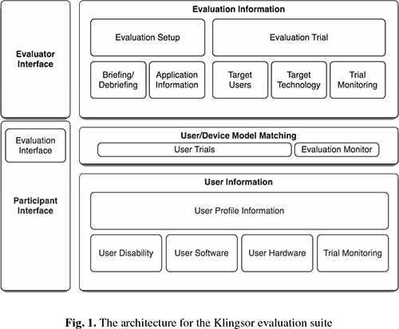

# Tekster som handler om evalueringsmetoder for universell utforming (UU-ASS)

[Home](./README.md)

Det fins noen tekster som handler om evalueringsmetoder for universell utforming:
* [Bai et al. (2019) Evaluating accessibility testing in automated software build processes](#bai-et-al-2019-evaluating-accessibility-testing-in-automated-software-build-processes)
* [Power & Petrie (2019) Working With Participants](#power-petrie-2019-working-with-participants)
* [Bai et al. (2018) Categorization and Comparison of Accessibility Testing Methods for Software Development](#bai-et-al-2018-categorization-and-comparison-of-accessibility-testing-methods-for-software-development)
* [Sauer et al. (2018) Extra-laboratorial usability tests: An empirical comparison of remote and classical field testing with lab testing](#sauer-et-al-2018-extra-laboratorial-usability-tests-an-empirical-comparison-of-remote-and-classical-field-testing-with-lab-testing)
* [Miao et al. (2016) Contrasting usability evaluation methods with blind users](#miao-et-al-2016-contrasting-usability-evaluation-methods-with-blind-users)
* [Bai et al. (2016b) A cost-benefit evaluation of accessibility testing in agile software development](#bai-et-al-2016b-a-cost-benefit-evaluation-of-accessibility-testing-in-agile-software-development)
* [Bai et al. (2016a) Evaluation of Accessibility Testing Methods. Which Methods Uncover What Type of Problems?](#bai-et-al-2016a-evaluation-of-accessibility-testing-methods-which-methods-uncover-what-type-of-problems)
* [Bruun & Stage (2012) The effect of task assignments and instruction types on remote asynchronous usability testing](#bruun-stage-2012-the-effect-of-task-assignments-and-instruction-types-on-remote-asynchronous-usability-testing)
* [Power et al. (2011) Remote Evaluation of WCAG 2.0 Techniques by Web Users with Visual Disabilities](#power-et-al-2011-remote-evaluation-of-wcag-20-techniques-by-web-users-with-visual-disabilities)
* [Power et al. (2009) A Framework for Remote User Evaluation of Accessibility and Usability of Websites](#power-et-al-2009-a-framework-for-remote-user-evaluation-of-accessibility-and-usability-of-websites)
* [Bruun et al. (2009) Let your users do the testing: a comparison of three remote asynchronous usability testing methods](#bruun-et-al-2009-let-your-users-do-the-testing-a-comparison-of-three-remote-asynchronous-usability-testing-methods)
* [Petrie et al. (2006) Remote usability evaluations with disabled people](#petrie-et-al-2006-remote-usability-evaluations-with-disabled-people)
* [Brush et al. (2004) A comparison of synchronous remote and local usability studies for an expert interface](#brush-et-al-2004-a-comparison-of-synchronous-remote-and-local-usability-studies-for-an-expert-interface)
* [Boren and Ramey (2000) Thinking aloud: reconciling theory and practice](#boren-and-ramey-2000-thinking-aloud-reconciling-theory-and-practice)

## General

[__Bai et al. (2019)__](#bai-et-al-2019-evaluating-accessibility-testing-in-automated-software-build-processes) presented an overview over available automatic assessment, and discusses means of assessment and analysis for the different tools. 
They argue that tools based on the aXe-core rulesets are superior to those based on HTML-CS to-date.
[__Power & Petrie (2019)__](#power-petrie-2019-working-with-participants) emphasize four key aspects when working with people with disabilities: (1) treating participants with respect throughout the process () ethics, language, supportive facilities), (2) anticipating needs and preferences for alternative format materials, (3) ensuring minimum technical accessibility  standards prior, and (4) identifying the best support setup (locally or remote).
[__Bai et al. (2018)__](#bai-et-al-2018-categorization-and-comparison-of-accessibility-testing-methods-for-software-development) expended W3C accessibility cognitive barriers from one to three resulting in seven barriers in total (Aud, A&M, HLL, L&N, Phy, Spe, Vis), and categorized accessibility tools in different categories (Auto, Check, Sim, AT, Exp) including an indication of their cost for developers.
Moreover, they analyzed four assessment methods for each of the categories showing the accessibility barriers they cover. 
[__Sauer et al. (2018)__](#sauer-et-al-2018-extra-laboratorial-usability-tests-an-empirical-comparison-of-remote-and-classical-field-testing-with-lab-testing) investigated the effects of testing environment in usability testing along the parameters of different types of artefacts (website, mobile phone simulation, mobile phone), methodological approaches (syncrhonous/asynchronous remote testing, field testing, local lab testing), and operational conditions (good/poor usability, dual tasks demands).
They found that no significant difference between field and lab-based testing in situtations where circumstances were favorable, at the same time as some differences occured in cases were circumstances were not favorable.
They advise to conduct usability testing as close as possible to the real life situation.
[__Miao et al. (2016)__](#miao-et-al-2016-contrasting-usability-evaluation-methods-with-blind-users) did something.
[__Bai et al. (2016b)__](#bai-et-al-2016b-a-cost-benefit-evaluation-of-accessibility-testing-in-agile-software-development) analyzed accessibility methods with respect to resources and knowledge requirements in terms of a cost-benefit analysis. Moreover, they described the inclusion of testing methods into an agile process by using an agile accessibility spiral.
Research by [__Bai et al. (2016a)__](#bai-et-al-2016a-evaluation-of-accessibility-testing-methods-which-methods-uncover-what-type-of-problems) support the hypothesis that a combination of multiple assessment methods covers a wide range of critical and confusing accessibility issues. 
They showed that no single method is superior to any other, but presented evidence that a combination of expert testing methods can give good results.
[__Bruun & Stage (2012)__](#bruun-stage-2012-the-effect-of-task-assignments-and-instruction-types-on-remote-asynchronous-usability-testing) did something.
[__Power et al. (2011)__](#power-et-al-2011-remote-evaluation-of-wcag-20-techniques-by-web-users-with-visual-disabilities) propose a lightweight, flexible and remote methodology using a text website and questionnaires to assess implementation techniques for WCAG Success Criterion that they demonstrate on the Success Criterion 2.4.4. 
The results suggest that only an explanation in plain text within an anchor element fulfills the criterion almost 100% of the time, although other techniques can reach high compliance as well.
[__Power et al. (2009)__](#power-et-al-2009-a-framework-for-remote-user-evaluation-of-accessibility-and-usability-of-websites) defines requirements and architectur of an automated online tool to help with the design, deployment and analysis of evaluations with participants that have some sort of impairment.
[__Bruun et al. (2009)__](#bruun-et-al-2009-let-your-users-do-the-testing-a-comparison-of-three-remote-asynchronous-usability-testing-methods) compared three remote asynchronous usability testing methods (user-reported critical incidents, forum-based online reporting and discussion, diary-based longitudinal user reporting) with conventional laboratory-based thinking aloud testing as benchmark. 
They found out that the remote methods found significantly less issues (with the diary performing at 50% for some of the issue types), at the same time as they require significantly less time.
[__Petrie et al. (2006)__](#petrie-et-al-2006-remote-usability-evaluations-with-disabled-people) conducted two case studies (one formative, one summative) for asynchronous remote assessment methods and compared the results to local evaluation.
Their results show that the quantitative data is highly comparable, at the same time as the amount and richness of the qualitative data is much lesser for the remote evaluation.
They conclude that remote evaluation is highly appropriate for summative studies, whereas local evaluation should be used for formative studies.
[__Brush et al. (2004)__](#brush-et-al-2004-a-comparison-of-synchronous-remote-and-local-usability-studies-for-an-expert-interface) compared results from a local and a synchronous remote usability study.
The results suggest that the number of usability issues found including type and severity is comparable, at the same time as the qualitative experience may differ.
[__Boren and Ramey (2000)__](#boren-and-ramey-2000-thinking-aloud-reconciling-theory-and-practice) did something.

## Bai et al. (2019) Evaluating accessibility testing in automated software build processes

[Up](#tekster-som-handler-om-evalueringsmetoder-for-universell-utforming-uu-ass)

Bai et al. (2019) presented an overview of automated tools at build time, discussed criteria to choose a tool (ruleset, active development, environment, etc.) and analyze the underlying most common rulesets (aXe-core and HTML-CS) which they identify as the most significant factor of difference.
They point out that both rulesets cover only a fraction of the available WCAG 2.1 rules at the same time as they are highly trustworthy with the issues they actually report (with aXe-core being superior to HTML-CS).
Moreover, they point out the necessity of an updated website to demonstrate (none-)compliancy with WCAG rules.

## Power & Petrie (2019) Working With Participants

[Up](#tekster-som-handler-om-evalueringsmetoder-for-universell-utforming-uu-ass)

Power and Petrie (2019) present core barriers and common solutions for website evaluation with participant with disabilities.
1. They give general advice concerning ethics (checklists, ethics committee), and recruitment and engagement (local/national organizations, interesting experience, briefing, debriefing). 
2. They discuss physical environments (travel, access), alternative formats or enhanced materials (bigger print, transcript), individual assistance (personal, interpreter), and language (ask about preferences).
3. They present generative user research as methodologies for understanding users and their needs and preferences including questionnaires (should be technically accessible), and focus groups (how does the interaction work? include people with different disabilities? how many?) and interviews to contextualize the data from the questionnaires.
4. They show evaluative user research to refine design in an iterative cycle, collect information, or understand impact of different design choices.
The researchers should minimum of accessibility, keep track of assistive tools, consider in-situ or remote evaluation (asynchronous, synchronous, provide appropriate training material), provide protocol for formative evaluations, and consider recording of different performance and preference variables.

## Bai et al. (2018) Categorization and Comparison of Accessibility Testing Methods for Software Development

[Up](#tekster-som-handler-om-evalueringsmetoder-for-universell-utforming-uu-ass)

Bai et al. (2018) categorized accessibility barriers from a testing point of view, rather than a medical, and focused on digital solutions rather than physical environments basing their categories on W3C accessibility barriers.
They expand W3C cognitive barriers from one to three ending up with seven categories in total:

|Abbr.|Name|Description|
|-|-|-|
|Aud|Auditory|Barriers of audible content.|
|A&M|Attention and memory|Barriers of complex or long-time operation sequences or invasive sensory content.|
|HLL|Higher level logic|Barriers of complex comprehension or problem solving tasks content.|
|L&N|Language and numbers|Barriers of dens textual or numerical content, difficult terms, use of inaccessible representation.|
|Phy|Physical|Barriers of one-mode-only operations.|
|Spe|Speech|Barriers of speech-required content.|
|Vis|Visual|Barriers of visual content|

They also categorized different assessment methods based on their cost, measured in completion time, and how different they are.
They emphasize the importance of combining various methods to covers as many barriers as possible.

|Abbr.|Name|Cost|Description|
|-|-|-|-|
|Auto|Automatic|Low|_Automatic_ assesment.|
|Check|Checklists|Medium|Using a _checklist_ or guideline.|
|Sim|Simulation|Low|Using _simulation_ as wearable or tool to simulate a barrier.|
|AT|Assisstive technology|Medium|Using _assisstive technology_ used by people to overcome a barrier.|
|Exp|Expert|High|Walkthrough methods requiring an _expert_.|

Finally, they list four typical accessibility testing tools for each of the assessment categories indicating the accessibility barriers they cover.

## Sauer et al. (2018) Extra-laboratorial usability tests: An empirical comparison of remote and classical field testing with lab testing

[Up](#tekster-som-handler-om-evalueringsmetoder-for-universell-utforming-uu-ass)

Sauer et al. (2018) investigated the influnece of testing enviornments on usability testing including physical features (lab, field, home, etc.), social features (evaluator being presented or not), and difficulty of the task (duality, good/low usability, etc.).
they conducted three experiments where they analyzed factors of type (field-based, synchronous/asynchronous remote), product quaity (usability, price), task demand (single v dual) in a summative study where they analyzed quantitative measurements (performance, perceived usability, etc.):
1. Synchronous v asynchronous testing v lab-based testing.
There was no effect of testing method. Neither remote testing methods or the lab-based method had a significant advantage or disadvantage.
2. Aynchornous remote testing vs lab-based testing using different artefact (computer simulation of a smartphone) and different product quality (bad/good usability, price).
They showed the importance of product properties and testing methods, and the influence of social expectations.
There was no difference in performance between remote and local evaluation for a product with good usability, however performance was worse in the local than in the remote testing for a product with bad usability.
they explaide that with a social inhibition effect that states that `performance on more difficult tasks is impaired during the presence of others`.
Moreover usability rating were higher in local evaluation than in remote testing.
This can be explained by social expectations, namely that users are more hesitant about negavite feedback if the evaluator is present.
3. Field testing v lab-based testing using a singel/dual task approach.
They did not find a significant difference due to testing method used.
Performance were poorer foir the single task in the local than in the field evaluation.
In the field, dual task had a poorer performance than the single task, whereas in the lab there was no significant difference.
Field/dual had the poorest performance, lab/dual had the best performance.
The authors explain that with the role of arousal. More precisely having the second task raising arousal in the lab to an optimal level.

To sum up, Sauer et al. (2018) found out that the outcome of usability testing depends on a complkex interaction between multiple variables and factors including usability, demand, social expectations, etc.
however, the output may be difficult to predict.
Moreover, the presence of others (e.g. the evaluator) may interact with task difficulty.
On the one hand, presence (virtual or physical) might increase physiological arousal.
On the other hand, presence might increase the need to confirm hte other's social expectations.

They conclude, that different testing methods did not show any obvious different main effects, at the same time as other contextual factors (usability, difficulty, evaluator presence etc.) moderate the influence on the outcome noteably.
They advise, therefore to test a system as close as possible to the real case setting.

## Miao et al. (2016) Contrasting usability evaluation methods with blind users

[Up](#tekster-som-handler-om-evalueringsmetoder-for-universell-utforming-uu-ass)

## Bai et al. (2016b) A cost-benefit evaluation of accessibility testing in agile software development

[Up](#tekster-som-handler-om-evalueringsmetoder-for-universell-utforming-uu-ass)

Bai et al. (2016b) categorized accessibility testing tools in five categories and indicated how much resources and knowledge each category requires.
They investigated how many general, critical and/or cognitive issues assessment methods of each type would discover, and performed a cost-benefit analysis (CBA) with respect to resources and knowledge requirements.

|Abbr.|Group|Resource requirements|Knowledge requirements|
|-|-|-|-|
|Auto|Automated tools|Low|Low|
|Check|Checklist and guidelines|Low|Low|
|Sim|Simulation using wearables|Medium|Low|
|Exp|Expert walkthrough|Low|High|
|User|User testing|High|Meidum|

In their empirical anaylysis, they found that a combination of Auto (?), Sim (1), Check (3,5,8), and Exp (6) methods covers a high percentage of issues with respect to its cost.
They also discussed how and when to prioritize different methods in an agile development process, represented in the so-called _agile accessibility spiral_ starting with Auto, Sim, Check, and finally Exp methods.

## Bai et al. (2016a) Evaluation of Accessibility Testing Methods. Which Methods Uncover What Type of Problems?

[Up](#tekster-som-handler-om-evalueringsmetoder-for-universell-utforming-uu-ass)

Bai et al. (2016a) categorized assessment methods into four main groups based on knowledge and resources required to use the methods:
1. testing using automatic or semi-automatic tools and guidelines,
2. simulation kit where a wearable is used,
3. expert testing, and
4. testing with users.

They investigated whether assessment methods would reveal technical, usable, critical and/or confusing issues.
Moreover, they investigated whether a method would reveal a unique issue.

In their empirical evaluation, they investigated methods from the first three categories (Simulation kit -> 2, VATLab -> 1, Persona testing -> 3, WCAG -> 1 + 3) excluding user testing.
Their results showed no superior method among the methods investigated.
However, the expert testing methods were complementing each other for finding critical and confusing issues.
Thus, the authors advocate for using multiple methods.

## Bruun & Stage (2012) The effect of task assignments and instruction types on remote asynchronous usability testing

[Up](#tekster-som-handler-om-evalueringsmetoder-for-universell-utforming-uu-ass)

## Power et al. (2011) Remote Evaluation of WCAG 2.0 Techniques by Web Users with Visual Disabilities

[Up](#tekster-som-handler-om-evalueringsmetoder-for-universell-utforming-uu-ass)

Power et al. (2011) present a lightweight and flexible methodology to efficiently collect data supporting or rejecting different WCAG techniques from users with visual disabilities remotely. 
In their technique they
(1) setup a website where each webpage represents one specific task implemented in one specific technique,
(2) recruit participants online through crowdsourcing,
(3) instruct users to website and undertake small tasks,
(4) answer through questionnaires (correct answer, confidence and difficulty rating), and
(5) collect data about the operating system, user agent and assistive technologies.
They implemented this approach for evaluating different implementation techniques for the WCAG 2.0 Success Criterion 2.4.4 (accessibility of links).
The results suggest that only G91 (clear text embedded in anchor tag) succeeds in almost 100% of the time, although other techniques like G53 (click her), H30 (alt image text), H77 (enclosing list), etc. can reach high success and confidence and low difficulty as well.

## Power et al. (2009) A Framework for Remote User Evaluation of Accessibility and Usability of Websites

[Up](#tekster-som-handler-om-evalueringsmetoder-for-universell-utforming-uu-ass)

Power et al. (2009) present a framework for the architecture and implementation of an application that can assist with managing the design of remote evaluations of accessibiility and usability, it deployment to target groups, and the analysis of its data. 
They discuss some of the challenges related to remote assessment of accessibility and usability with users that have some sort of impairment, and define some requirements for an application that aims to address these challenges.

To begin with, they classify remote evaluations into:
* portable evaluations,
* lcoal evaluation at a remote site,
* remoe questionnaires/surveys,
* remote control evaluation,
* video conferencing,
* instrumented remote evaluation, and
* semi-instrumented remote evaluation.

they also mention other categorization dimensions like independence/dependence upon the evaluator, dimension of synchronicity (synchron/asynchron), training requirements, type of methodology, type of data, etc.

Furthermore, they define the four stages of the evaluation process:
1. The recruitment of a represnetative group (plus the recording of their demographic information).
2. The design of experimentatls tasks representative of the final use of the application.
3. The deployment of the evaluation method to the participants including some sort of instructions.
4. The analysis of the data through a set of qualitative and quantitative methods.

For the participants, the framework should require the following:
* Recording of their demographic information (age, sex, functional disability, nationality [?], etc.);
* Privacy options;
* Technology configurations and experience (general OS, user agents, AT, etc.);
* Allowing multiple context of uses;
* Preference about type and number of trials;
* Methodology preferences (good to record, CI, survey, etc.);
* Log of their activity for reimbursement.

For the evaluators, the framework requires:
* Artifact specifications;
* Specification for tasks, questions (before, during and after trial), answer options (alternate choice, multiple choice, Lickert scale, open answer, etc.), target groups, etc.;
* Saving subpgroups;
* Providing instructions and training documents;
* Specify and external tool used for remote monitoring;
* Retrieving collected data to perform analyses.
 
Power et al. (2019) specify the architecture of an evaluation framework that they call `Klingsor: A Remote Evaluation Tool Suite` (cf. Fig. 1).
The framework consists of:
1. An evaluator interface:
   * Evaluation setup:
      * Briefing
      * Debriefing
      * Application information
   * Evaluation trial (task):
      * Target users:
      * Target technology
      * Trial monitoring     
2. An participant interface:
   * User profile information:
      * User disability
      * User disability
      * User hardware
      * Trial monitoring
 

## Bruun et al. (2009) Let your users do the testing: a comparison of three remote asynchronous usability testing methods

[Up](#tekster-som-handler-om-evalueringsmetoder-for-universell-utforming-uu-ass)

Bruun et al. (2009) compare three remote usability testing methods with conventional lab testing.
Remote synchronous testing is defined as test users and evaluator are separated in space, whereas asynchronous methods are defined as test users and evaluators are separated in space _and_ time.
They identified several asynchronous testing methods:
* auto-logging (collecting quantitative data that is being analyzed, often combined with interviews and/or questionnaires),
* user-reported critical incident method (UCI) (users report problems themselves),
* unstructured problem reporting (participants make note of problems while they work on tasks),
* forum (collecting qualitative data during auto-logging),
* diary (collecting qualitative data during auto-logging).

The authors investigated UCI, forum, and diary testing methods, and used user-based laboratory testing as a benchmark.
The results show that the remote methods reveal significantly less usability issues that the lab method with the diary revealing the most issues at around 50%. At the same time the remote methods use significantly less time than the lab method in terms of man hours.
The authors point out the low sample size (10) and bias of the observers, at the same time as they hypothesize that training plays an important role in the success rate (written instructions only vs video training and exercises, online training tool).

## Petrie et al. (2006) Remote usability evaluations with disabled people

[Up](#tekster-som-handler-om-evalueringsmetoder-for-universell-utforming-uu-ass)

Petrie et al. (2006) present different methods for remote assessment and discuss the dimensions that play a role when choosing an appropriate method for given study (synchronous vs asynchronous, participant independence, intrusive vs unobtrusive, training requirement, formative or summative evaluation).
They point out the advantages of remote (facilitate traveling, wider spectrum of assistive technology) and it disadvantages (shallower understanding for the evaluator).
They present two studies for formative and summative evaluations, where they compare results for local and asynchronous remote assessment with disabled participants.
In the first study the have a formative evaluation of a technical program for blind people, whereas in the second study they have a summative evaluation of websites by people with disabilities.
In both studies participants had to accomplish tasks after being divided into two groups: The first group was asked to do the tasks in-situ while thinking aloud, whereas the other group was asked to complete the tasks on their own time at their own preferred place.
There were also additional questionnaires and post evaluation interviews (face-to-face or phone).
The quantitative data collected in both remote and local evaluation was comparable, at the same time as the amount and richness of the qualitative data was much lower for the remote evaluation. 
Thus, the authors argue that remote evaluation might be appropriate for summative evaluations, while local assessment was best suited for formative evaluation.
Moreover, they list recommendations for local evaluation (investigating assistive tools beforehand, access to location, configuration time, special needs) and remote evaluations (appropriate training material beforehand, wider variety of assistive tools, synchronous vs asynchronous, follow-up phone).

## Brush et al. (2004) A comparison of synchronous remote and local usability studies for an expert interface

[Up](#tekster-som-handler-om-evalueringsmetoder-for-universell-utforming-uu-ass)

Brush et al. (2004) compared results from a local (think aloud) and a synchronous remote (think alone over phone) usability study, investigating usability issues found, participants experience, and facilitator's experience.
The results suggest that the number of usability issues found including type and severity is comparable, at the same time as the qualitative experience may differ.
For the remote study, they point out that preparation required more effort, recruitment was easier, the tone of voice was enough to sense frustration, and that most of their participants would either prefer both methods equally or the remote evaluation in the future.

## Boren and Ramey (2000) Thinking aloud: reconciling theory and practice

[Up](#tekster-som-handler-om-evalueringsmetoder-for-universell-utforming-uu-ass)
