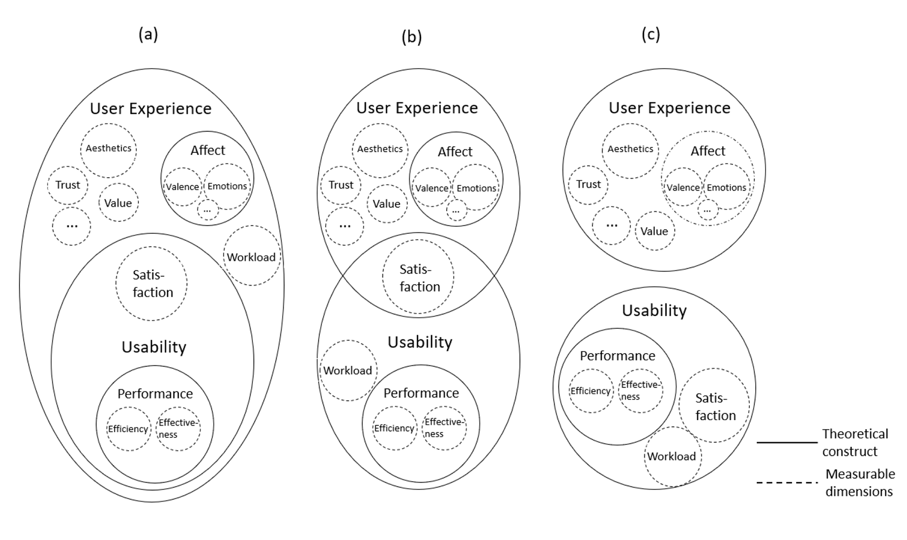
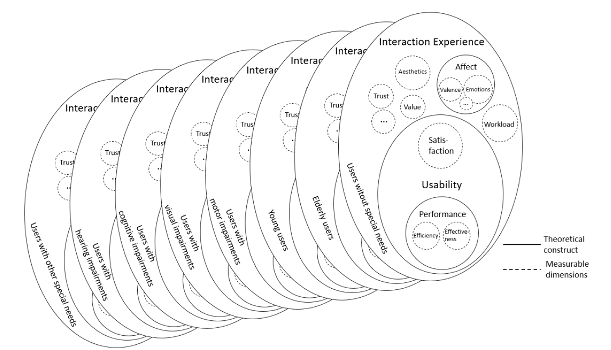

# Tekster om generele definisjoner av universell utforming (UU-DEF)

Det fins noen tekster som inneholder generelle definisjoner om universell utforming, tilgjengelighet og brukervennlighet:
* [__Sauer et al. (2020)__ Usability, user experience and accessibility: towards an integrative model](#sauer-et-al-2020-usability-user-experience-and-accessibility-towards-an-integrative-model)
* [__Petrie & Bevan (2009)__ The evaluation of accessibility, usability and user experience](#petrie-bevan-2009-the-evaluation-of-accessibility-usability-and-user-experience)
* [__Miljødepartementet (2007)__ Universell utforming - begrepsavklaring](#miljødepartementet-2007-universell-utforming-begrepsavklaring)

## General

[__Sauer et al. (2020)__ Usability, user experience and accessibility: towards an integrative model](#sauer-et-al-2020-usability-user-experience-and-accessibility-towards-an-integrative-model) review common definitions of the concepts of usability, user experience (UX) and accessibility, discuss their relationship to each other and analyze definitions, evaluation methods and typical outcome measures.
They propose a new term called `interaction experience (IX)` as a higher-level concept expression.
[__Petrie & Bevan (2009)__ The evaluation of accessibility, usability and user experience](#petrie-bevan-2009-the-evaluation-of-accessibility-usability-and-user-experience) define the concepts of accessibility, usability and user experience, discuss two versions of the iterative user-centered design lifecycle, and present different evaluation methods for accessibility, usability and user experience including their strengths and weaknesses.
[__Miljødepartementet (2007)__](#miljødepartementet-2007-universell-utforming-begrepsavklaring) presenterer definisjonen for universell utforming (uu) til The Center for Universal Design ved North Carolina State University, og forklarer hva de ulike begrepene betyr i praksis.
De definerer likestilling og deltakelse ved å fjerne barrierer som hovedmål av uu, og framhever at uu underbygger andre samfunnsmål.

## Sauer et al. (2020) Usability, user experience and accessibility: towards an integrative model 

[Up](#tekster-om-generele-definisjoner-av-universell-utforming-uu-def)

Sauer et al. (2020) discuss different definitions of usability, that can be roughly categorized into 
* product-oriented perspective,
* user-oriented perspective,
* performance-oriented perspective, and
* context-oriented perspective.

They list two main categories of evaluation methods:
* Formative testing which is trying to improve a system by identifying problems during the development cycle.
* Summative testing which is trying to evaluate the quality of a system compared to another product or a standard.

They discuss different definitions of user experience (UX) that they categorize into
* holistic view,
* extension of the usability concept,
* primary focus on emotion.

They define accessibility with respect to four main types of impairments:
* visual,
* hearing,
* motor, and
* cognitive.

They also mention the concept of `design for all`, `inclusive design`, and `universal design`.

They emphasize that the similarities and differences of usability and UX depend on the chosen definition for UX. The holistic view gives the broadest approach, another definition encompasses only the subjective components into UX but not the performance/behavior components, where the narrowest definition only includes the affective outcome to UX.
They point out the accessibility may be more related to usability than to user experience.
Finally, they state that formative testing might be used in both accessibility and UX development processes as well.



They list some evaluation methods for usability, user experience, and accessibility. 
You can read about this [here](./UU-ASS.md#sauer-et-al-2020-usability-user-experience-and-accessibility-towards-an-integrative-model).

The introduce `interaction experience (IX)` as new high-level concept which encompasses both user experience and usability including important ideas from accessibility.
They highlight again the close relationship between accessibility and usability founded on research by Schmutz et al. (2016, 2017, 2018, 2019).




## Petrie & Bevan (2009) The evaluation of accessibility, usability and user experience

[Up](#tekster-om-generele-definisjoner-av-universell-utforming-uu-def)

They are using the definitions from ISO 9241-11 - Ergonomics of Human System Interaction - Part 11 for: 
* usability, 
* effectiveness, and 
* satisfaction.

They argue that the following components should be included to usability as well:
* flexibility: `the extent to which the system can accommodate changes desired by the user beyond those first specified`
* learnability: `the time and effort required to reach a specified level of use performance with the system (also known as ease of learning) `
* memorability: `the time and effort required to return to a specified level of use performance after a specified period away from the system`
* safety: `aspects of the system related to protecting the user from dangerous conditions and undesirable situations`

They are using the definitions from ISO 9241-171 - Ergonomics of Human System Interaction - Part 171: Guidance on software accessibility.

They are using the definition from ISO 9241-210 - Ergonomics of Human System Interaction - Part 210: Human-centered design for interactive systems for user experience (UX).

They describe user experience (UX) as concept to cover the components of a user's interaction with and reactions to an application beyond effectiveness, efficiency, and traditional interpretation of satisfaction.
They list different areas that UX investigate:
* holistic, 
* subjective,
* positive
* process,
* outcomes,
* affect,
* likability,
* pleasure
* comfort
* trusty

They discuss design and evaluation processes, and present evaluation methods for usability, accessibility and user experience (UX).
You can read about this [here](./UU-ASS.md#petrie-bevan-2009-the-evaluation-of-accessibility-usability-and-user-experience)

## Miljødepartementet (2007) Universell utforming - begrepsavklaring

[Up](#tekster-om-generele-definisjoner-av-universell-utforming-uu-def) |
[Kilde](https://www.regjeringen.no/no/dokumenter/t-1468-universell-utforming/id493083/)

Regjeringen følger definisjonen til The Center for Universal Design ved North Carolina State University:
```
Universal design is the design of products and environments to be usable by all people, to the greatest extend possible, without the need for adaptation or specialized design.
```

```
Universell utforming er utforming av produkter og omgivelser på en slik måte at de kan brukes av alle mennesker, i så stor utstrekning som mulig, uten behov for tilpassing og en spesiell utforming.
```

De definerer likestilling og deltakelse for personer med nedsatt funksjonsevne ved å fjerne barrierer som hovedmål. 
De framhever at uu gjelder for alle sektorer og fagområder samt IKT, for mennesker i alle aldersgrupper og med ulike ferdigheter, kapasitet og funksjonsevne. 
De forklarer at uu trenger kontinuerlig vurdering og nevner begrensninger. 
De understreker at det ikke er behov for ettarbeiding for å skape brukbare løsninger med uu. 
De viser hvordan uu kan støtte andre samfunnsmål som bærekraftig utvikling, miljø, mangfold, sikkerhet i bruk og ved brann, estetikk, osv. 
De forklarer at uu trenger tverrfaglighet, bred deltakelse fra brukerorganisasjoner og brukere, og presisjon ved utforming, drift og vedlikehold. 


